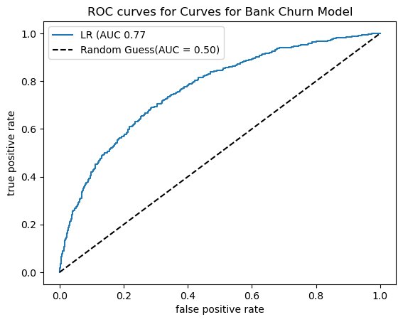
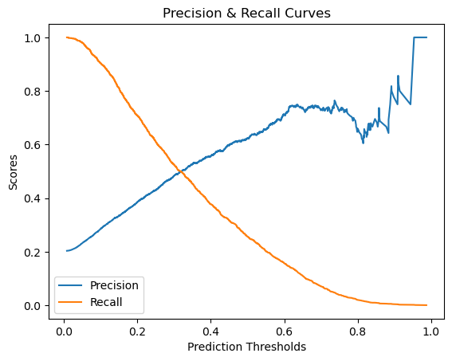
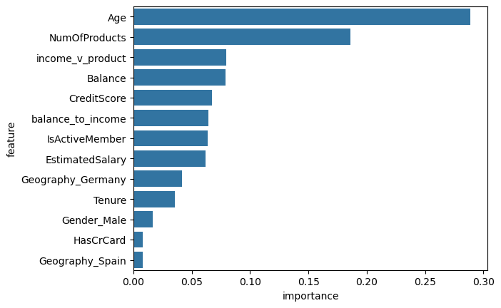

# 🏦 Bank Customer Churn Classification

A machine learning project that predicts which bank customers are likely to leave (churn), using customer demographics and account activity. Two models are built and compared: **Logistic Regression** and a tuned **Random Forest**.


## 📋 Overview

Keeping an existing customer is far cheaper than winning a new one. This project uses a dataset of **10,000 bank customers** to identify who is at risk of churning so the bank can act early.

**Target variable:** `Exited` (1 = customer left the bank, 0 = stayed)

## 📈 Model Results

Charts produced by the notebook: the ROC curve and precision/recall trade-off for logistic regression, and feature importance from the tuned random forest.

<p align="center">
  
  
</p>

<p align="center"></p>

## 🗂️ Dataset

`Bank_Churn.csv` — 10,000 rows, 13 columns:

| Column | Description |
|--------|-------------|
| `CreditScore` | Customer's credit score |
| `Geography` | Country (France, Germany, Spain) |
| `Gender`, `Age` | Demographics |
| `Tenure` | Years as a customer |
| `Balance` | Account balance |
| `NumOfProducts` | Number of bank products held |
| `HasCrCard`, `IsActiveMember` | Card ownership and activity flags |
| `EstimatedSalary` | Estimated annual salary |
| `Exited` | Churn flag (target) |

## 🔍 Workflow

1. **Exploratory analysis** — pair plots, a correlation heatmap, and box/bar plots of every feature split by churn status
2. **Feature engineering** — dropped ID columns and created two new features:
   - `balance_to_income` = Balance ÷ EstimatedSalary
   - `income_v_product` = EstimatedSalary ÷ NumOfProducts
3. **Encoding** — one-hot encoded `Geography` and `Gender`
4. **Train/test split** — 80/20
5. **Logistic Regression** — baseline model, evaluated with accuracy, precision, recall, F1, confusion matrix and ROC curve
6. **Threshold tuning** — used the precision-recall curve to lower the decision threshold to ~0.32
7. **Random Forest** — hyperparameters tuned in two rounds with `RandomizedSearchCV`
8. **Feature importance** — ranked the features driving churn predictions

## 📊 Results

| Model | Test Accuracy | Notes |
|-------|---------------|-------|
| Logistic Regression (threshold 0.5) | **81.3%** | Precision 0.62, recall 0.22, ROC AUC 0.77 |
| Logistic Regression (threshold 0.32) | — | Recall roughly doubled to 0.45 at precision 0.49 |
| Random Forest (tuned) | **86.0%** | `n_estimators=910`, `max_depth=12`, `min_samples_leaf=5`, `max_samples=0.6` |

**Takeaway:** the default logistic regression looks accurate but misses most churners (low recall). Lowering the threshold catches far more of them, and the tuned Random Forest gives the best overall accuracy.

## 📁 Repository Contents

```
├── Bank Customer Churn Classification.ipynb   # Full analysis and modelling notebook
├── Bank_Churn.csv                             # Dataset
└── README.md
```

## 🚀 How to Run

```bash
pip install pandas numpy scikit-learn matplotlib seaborn jupyter
jupyter notebook "Bank Customer Churn Classification.ipynb"
```

## 🛠️ Skills Demonstrated

EDA · feature engineering · classification modelling · hyperparameter tuning · model evaluation (precision/recall trade-offs, ROC/AUC) · feature importance

---

👤 **Tony Mulunda** — [GitHub @Scarface96](https://github.com/Scarface96)
